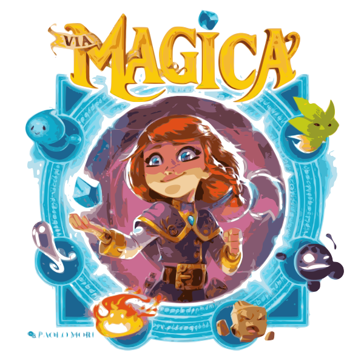

# via-magica-helper

Simple **RAW** javascript + HTML + CSS code to automate animus reading in [Via Magica](https://boardgamegeek.com/boardgame/300936/magica) game

You can find a free functional deploy [here](https://via-magica.surge.sh/)

It was done in record time for play! So don't judge me!

Supports speech through "SpeechSynthesisUtterance" speech engine to hear which Animus was captured
